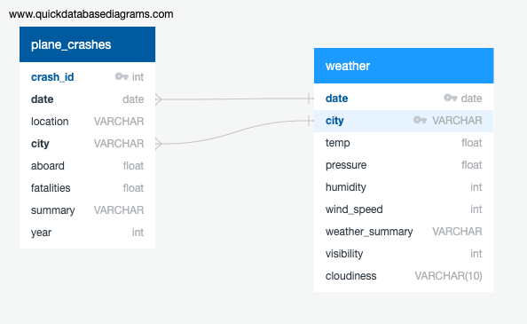

# ETL Airplane Crash 'Weather' or Not?
A database ready-set, to analyze the possible correlation of daily weather patterns and plane crashes.

* We start with two data-sets:
  * Airplane_Crashes_and_Fatalities_Since_1908_20190820105639.csv
  * The OpenWeather API
---
* We clean our plane crash data to isolate the cities for weather comparison.
* We aggregate our weather and plane crash data to only include data from 1980 to current.
* Since the plane crashes are documented by a city and state, we need to find our daily weather by 'nearest' city.
----
## We create an ERD to map our Primary and Foriegn key for our data-sets.

* Our final production database will be a relational database in postgresql.
* We will export our final two cleaned csv files from pandas to populate our relational database in pgadmin.
