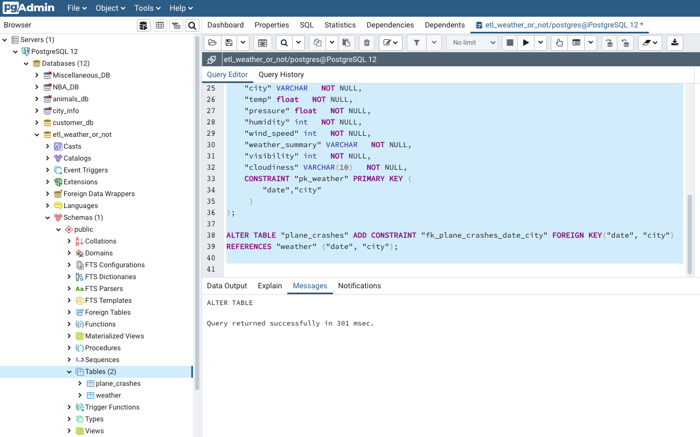
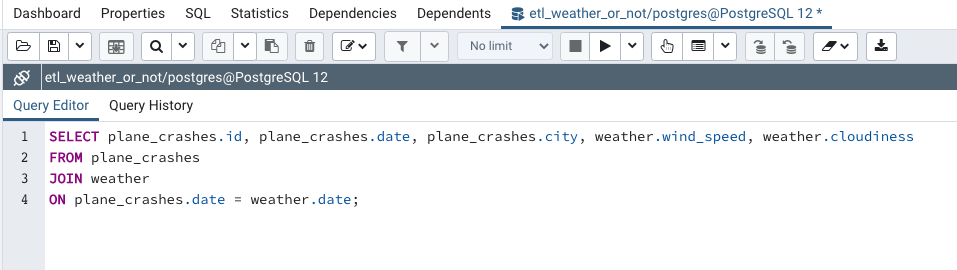

# ETL Airplane Crash 'Weather' or Not?
A database ready-set, to analyze the possible correlation of daily weather patterns and plane crashes.

* We start with two data-sets:
  * Airplane_Crashes_and_Fatalities_Since_1908_20190820105639.csv. This airplane crash database was from Kaggle: https://www.kaggle.com/saurograndi/airplane-crashes-since-1908
  * Weather Underground Historical Weather page: https://www.wunderground.com/history
---
## Challenges
* Current weather data is readily accessible in myriad formats. However, accessing historical weather data incurs a $10 charge for each city. Unfortunately, we have over 1500 cities to access and the cost associated with this approach was too cumbersome for us to undertake. The estimated cost would be $15,000. Any research group attempting to undertake this data analysis will need to overcome this significant hurdle in the future.

* In lieu of the paid historical weather data, we have populated the weather table with manually queried historical weather data from Weather Underground. Obviously, this is not a practical approach for an entire data set. 
---
## Cleaning
* We used pandas to clean our plane crash data, to isolate the cities for weather comparison.
* We needed to add a 'Year' and unique 'crash_id' column to out dataframe.
* We converted the date from conventional utc to unix timestamp. (THANKS JAY!)
* We aggregated our weather and plane crash data to only include data from 1980 to current.
* Since the plane crashes are documented by a city and state, we needed to find our daily weather by 'nearest' city/weather station.
----
## We created an ERD to map our Primary and Foreign key for our data-sets.

## Our final production database is a relational database in postgresql.
We exported our final two cleaned csv files 'plane_crashes.csv' 'weather.csv' from pandas to populate our relational database in pgadmin.

## Sample query in PgAdmin

